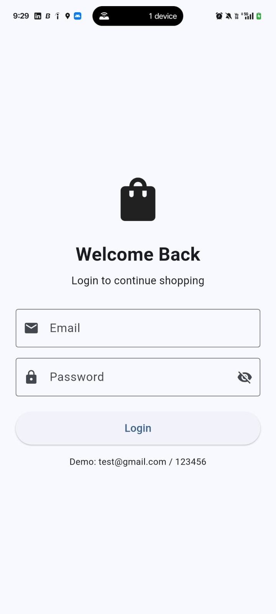
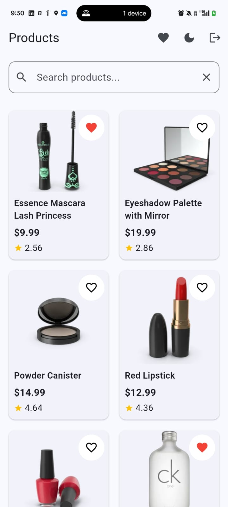
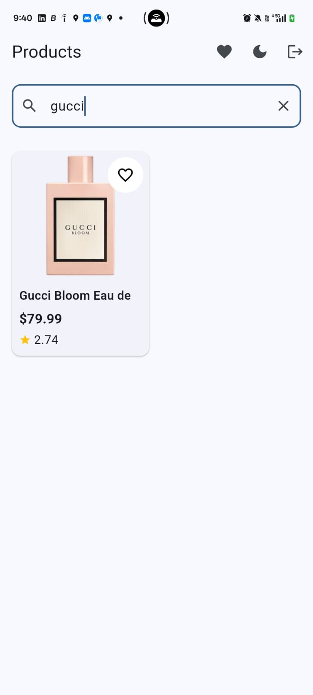
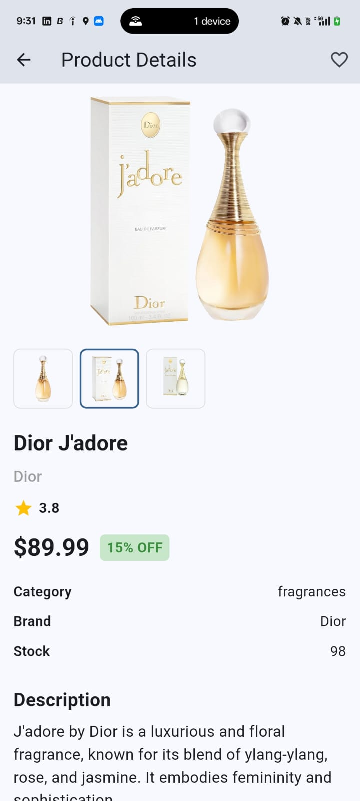
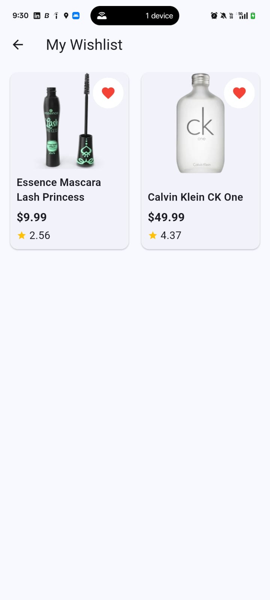
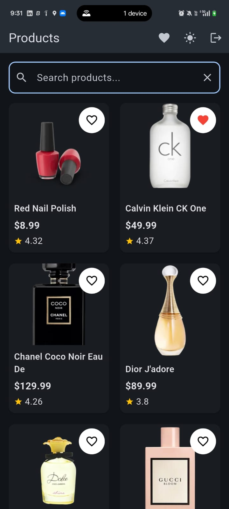

# E-Commerce Product Listing App

A Flutter e-commerce application built as part of a Flutter developer assignment. The goal was to build a clean, scalable, and production-ready app with product listing, search, pagination, wishlist, offline support, authentication, and dark mode — all following Clean Architecture principles.

---

## 📱 App Preview / Screenshots

| Login                                    | Product Listing                                 |
|------------------------------------------|-------------------------------------------------|
|     |    |

| Search                                   | Product Details                                 |
|------------------------------------------|-------------------------------------------------|
|    |  |

| Wishlist                                 | Dark Mode                                       |
|------------------------------------------|-------------------------------------------------|
|  |       |

---

## ✨ Features

- **Dummy Login Authentication** — hardcoded credentials with session persistence
- **Product Listing** — paginated grid view of products fetched from API
- **Product Details** — full detail page with images, price, rating, and stock info
- **Product Search** — live search with debounce support
- **Pagination** — load-more on scroll with skip/limit strategy
- **Pull-to-Refresh** — refresh the product list at any time
- **Wishlist / Favorites** — add or remove products locally with persistence
- **Offline Product Caching** — cached products displayed when there is no internet
- **Offline Wishlist Persistence** — wishlist remains available offline
- **Dark Mode** — toggle between light and dark theme
- **Responsive Product Grid** — clean grid layout with loading shimmer effect
- **Loading States** — initial load, load-more, and empty state handling
- **Error Handling** — user-friendly messages for all failure cases
- **Retry Mechanism** — retry failed requests from the UI
- **API Timeout Handling** — graceful handling of slow/unresponsive API
- **No Internet Handling** — detect connectivity and show cached data or error

---

## 🛠️ Tech Stack

| Category | Technology |
|----------|-----------|
| Framework | Flutter (Dart) |
| State Management | flutter_bloc ^9.1.1 |
| HTTP Client | dio ^5.11.0 |
| Local Storage | hive ^2.2.3 + hive_flutter ^1.1.0 |
| Navigation | go_router ^17.5.0 |
| Network Monitoring | connectivity_plus ^7.3.1 |
| Image Caching | cached_network_image ^3.4.1 |
| Equality | equatable ^2.1.0 |
| Architecture | Clean Architecture + Feature-based |
| DI | Manual Dependency Injection |
| Code Generation | hive_generator + build_runner |
| Testing | mocktail ^1.0.5 |

---

## 🌐 API

This project uses the **[DummyJSON](https://dummyjson.com) Products API** — a free fake REST API for testing and prototyping.

**Base URL:** `https://dummyjson.com`

| Endpoint | Usage |
|----------|-------|
| `GET /products` | Fetch paginated product list |
| `GET /products/search?q={query}` | Search products by keyword |

**Query Parameters:**

```
limit=10    →  Number of products per page
skip=0      →  Number of products to skip (for pagination)
```

**Sample Response:**
```json
{
  "products": [
    {
      "id": 1,
      "title": "Essence Mascara Lash Princess",
      "price": 9.99,
      "discountPercentage": 7.17,
      "rating": 4.94,
      "stock": 5,
      "brand": "Essence",
      "category": "beauty",
      "thumbnail": "https://...",
      "images": ["https://..."]
    }
  ],
  "total": 194,
  "skip": 0,
  "limit": 10
}
```

---

## 🏗️ Architecture

The project follows **Clean Architecture** with a **feature-based folder structure**, separating concerns across three layers:

```
┌─────────────────────────────────────┐
│         Presentation Layer          │  ← Widgets, Pages, BLoC
├─────────────────────────────────────┤
│           Domain Layer              │  ← Entities, Use Cases, Repository Interfaces
├─────────────────────────────────────┤
│            Data Layer               │  ← Models, Data Sources, Repository Implementations
└─────────────────────────────────────┘
```

**Data flows strictly in one direction:**

```
UI  →  BLoC  →  Use Case  →  Repository  →  Remote / Local Data Source
```

- The **Domain layer** has no dependencies on Flutter or any external package
- The **Data layer** implements repository contracts defined in the domain layer
- The **Presentation layer** only interacts with use cases through BLoC
- **Dependency Injection** is handled manually in `lib/core/di/injection.dart`

---

## 📁 Project Structure

```
lib/
│
├── core/
│   ├── constants/
│   │   └── api_constants.dart         # Base URL and API endpoint paths
│   ├── di/
│   │   └── injection.dart             # Manual DI wiring for all blocs
│   ├── error/
│   │   └── app_exception.dart         # Custom exceptions (Network, Timeout, Server)
│   ├── network/
│   │   └── dio_client.dart            # Dio HTTP client configuration
│   ├── theme/
│   │   └── theme_cubit.dart           # Light / dark mode cubit
│   └── utils/
│       └── debouncer.dart             # Search debounce utility
│
├── features/
│   │
│   ├── auth/
│   │   ├── data/                      # (reserved for future remote auth)
│   │   ├── domain/                    # (reserved for future auth entities/usecases)
│   │   └── presentation/
│   │       ├── bloc/
│   │       │   ├── auth_bloc.dart     # Login, logout, check session
│   │       │   ├── auth_event.dart
│   │       │   ├── auth_state.dart
│   │       │   └── auth_gate.dart     # Route guard based on auth status
│   │       └── pages/
│   │           └── login_page.dart
│   │
│   ├── products/
│   │   ├── data/
│   │   │   ├── datasources/
│   │   │   │   ├── product_remote_datasource.dart
│   │   │   │   └── product_local_datasource.dart
│   │   │   ├── models/
│   │   │   │   ├── product_model.dart       # JSON deserialization
│   │   │   │   └── product_hive_model.dart  # Hive adapter model
│   │   │   └── repositories/
│   │   │       └── product_repository_impl.dart
│   │   ├── domain/
│   │   │   ├── entities/
│   │   │   │   └── product.dart             # Core product entity
│   │   │   ├── repositories/
│   │   │   │   └── product_repository.dart  # Abstract repository interface
│   │   │   └── usecases/
│   │   │       ├── get_products.dart
│   │   │       └── search_products.dart
│   │   └── presentation/
│   │       ├── bloc/
│   │       │   ├── product_bloc.dart
│   │       │   ├── product_event.dart
│   │       │   └── product_state.dart
│   │       ├── pages/
│   │       │   ├── product_page.dart        # Main listing page
│   │       │   └── product_detail_page.dart
│   │       └── widgets/
│   │           ├── product_card.dart
│   │           └── ...
│   │
│   └── wishlist/
│       ├── data/
│       │   ├── datasources/
│       │   │   └── wishlist_local_datasource.dart
│       │   └── repositories/
│       │       └── wishlist_repository_impl.dart
│       ├── domain/
│       │   ├── repositories/
│       │   │   └── wishlist_repository.dart
│       │   └── usecases/
│       │       ├── get_wishlist.dart
│       │       ├── add_to_wishlist.dart
│       │       └── remove_from_wishlist.dart
│       └── presentation/
│           ├── bloc/
│           │   ├── wishlist_bloc.dart
│           │   ├── wishlist_event.dart
│           │   └── wishlist_state.dart
│           └── pages/
│               └── wishlist_page.dart
│
└── main.dart
```

---

## 🔄 State Management

The app uses **BLoC (Business Logic Component)** pattern via the `flutter_bloc` package.

All BLoCs are provided globally at the root of the widget tree via `MultiBlocProvider` in `main.dart`.

| BLoC / Cubit | Responsibility |
|---|---|
| `AuthBloc` | Login, logout, and session check on app start |
| `ProductBloc` | Product loading, pagination, search, and pull-to-refresh |
| `WishlistBloc` | Load wishlist, add to wishlist, remove from wishlist |
| `ThemeCubit` | Toggle and persist light / dark mode preference |

**ProductBloc Events:**

```
LoadProducts        →  Initial product fetch (resets pagination)
LoadMoreProducts    →  Appends next page (skip += 10)
SearchProduct       →  Searches by query with pagination support
RefreshProducts     →  Resets query and reloads from page 1
```

**ProductBloc States:**

```
loading      →  Initial full-screen loading
loadingMore  →  Appending next page (shows spinner at list bottom)
success      →  Products loaded and displayed
empty        →  No products found
failure      →  An error occurred (shows error message + retry)
```

---

## 💾 Offline Storage

**Hive** is used for all local data persistence. It is a lightweight, fast NoSQL database that does not require a native platform channel.

| Hive Box | Stored Data |
|---|---|
| `products` | Cached product list from the last successful API call |
| `wishlist` | User's saved / favorited products |
| `auth` | Login session flag (`isLoggedIn`) |

**Offline Strategy:**

When the network is unavailable, the `ProductRepositoryImpl` falls back to `ProductLocalDataSource` and serves the last cached product list. This ensures users can still browse products without an internet connection.

The wishlist is fully local and always available offline.

---

## ⚠️ Error Handling

All errors are mapped to typed custom exceptions defined in `lib/core/error/app_exception.dart`:

| Exception | Cause |
|---|---|
| `NetworkException` | No internet connection detected |
| `TimeoutException` | Request exceeded the configured timeout |
| `ServerException` | Non-2xx HTTP response from the server |
| `UnknownException` | Any other unexpected error |

The `ProductBloc` catches these exceptions and maps them to user-friendly messages rather than exposing raw technical errors. Error messages are displayed in the UI with a **Retry** button so the user can recover without restarting the app.

---

## ⚡ Performance

The following techniques keep the app smooth and efficient:

- **Pagination** — loads 10 products at a time using `skip` / `limit` to avoid fetching all data at once
- **Search Debounce** — delays the search API call while the user is still typing to reduce unnecessary requests
- **`GridView.builder`** — lazily builds only the visible grid items instead of all at once
- **Cached Network Images** — `cached_network_image` caches product images locally, preventing repeated downloads
- **Separate Loading States** — `loading` vs `loadingMore` states prevent the full-screen loader from blocking the already-loaded list during pagination
- **`BlocSelector`** — used in widgets to subscribe only to the specific piece of state they need, reducing unnecessary rebuilds
- **Proper Resource Disposal** — `TextEditingController`, `ScrollController`, and debounce timers are disposed in widget lifecycle methods

---

## 🔐 Demo Login

The app uses hardcoded credentials for the assignment demo. No backend auth service is required.

| Field | Value |
|---|---|
| Email | `test@gmail.com` |
| Password | `123456` |

The login session is persisted in a Hive box. The app remembers the logged-in state across restarts. Tapping **Logout** clears the session.

---

## 🚀 How to Run

### Prerequisites

- [Flutter SDK](https://docs.flutter.dev/get-started/install) (Dart SDK `^3.12.2`)
- Android Studio or VS Code with the Flutter plugin
- An Android device or emulator (API 21+)

### Steps

```bash
# 1. Clone the repository
git clone https://github.com/YOUR_USERNAME/ecommerce_app_task.git
cd ecommerce_app_task

# 2. Install dependencies
flutter pub get

# 3. Run the app
flutter run
```

> If you make changes to Hive model files, regenerate the adapters:
> ```bash
> dart run build_runner build --delete-conflicting-outputs
> ```

---

## 📦 Build APK

To build a release APK:

```bash
flutter build apk --release
```

The output file will be located at:

```
build/app/outputs/flutter-apk/app-release.apk
```

To install directly on a connected device:

```bash
flutter install
```

---

## ✅ Assignment Requirements

| Requirement | Status |
|---|---|
| Product listing from API | ✅ |
| Pagination (load more on scroll) | ✅ |
| Product detail page | ✅ |
| Search with debounce | ✅ |
| Wishlist with local persistence | ✅ |
| Offline caching | ✅ |
| BLoC state management | ✅ |
| Clean Architecture | ✅ |
| Dark mode | ✅ |
| Pull-to-refresh | ✅ |
| Error handling with retry | ✅ |
| Loading and empty states | ✅ |
| Authentication (dummy) | ✅ |

---

## 👤 Author

Built with Flutter as part of a Flutter developer assignment.

- **Framework:** Flutter 3.x / Dart 3.x
- **Architecture:** Clean Architecture + Feature-based structure
- **API:** [DummyJSON](https://dummyjson.com)
